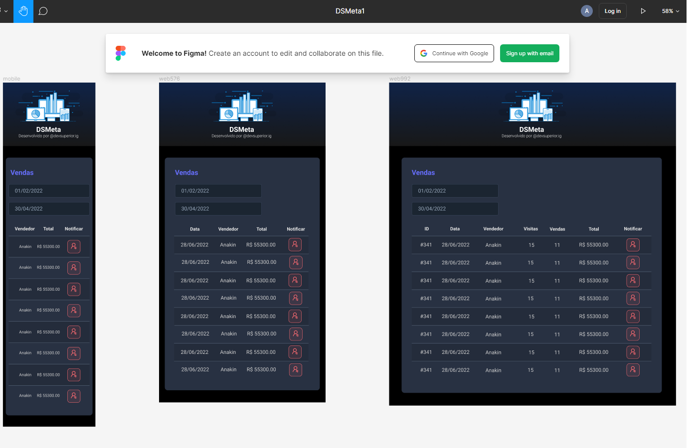
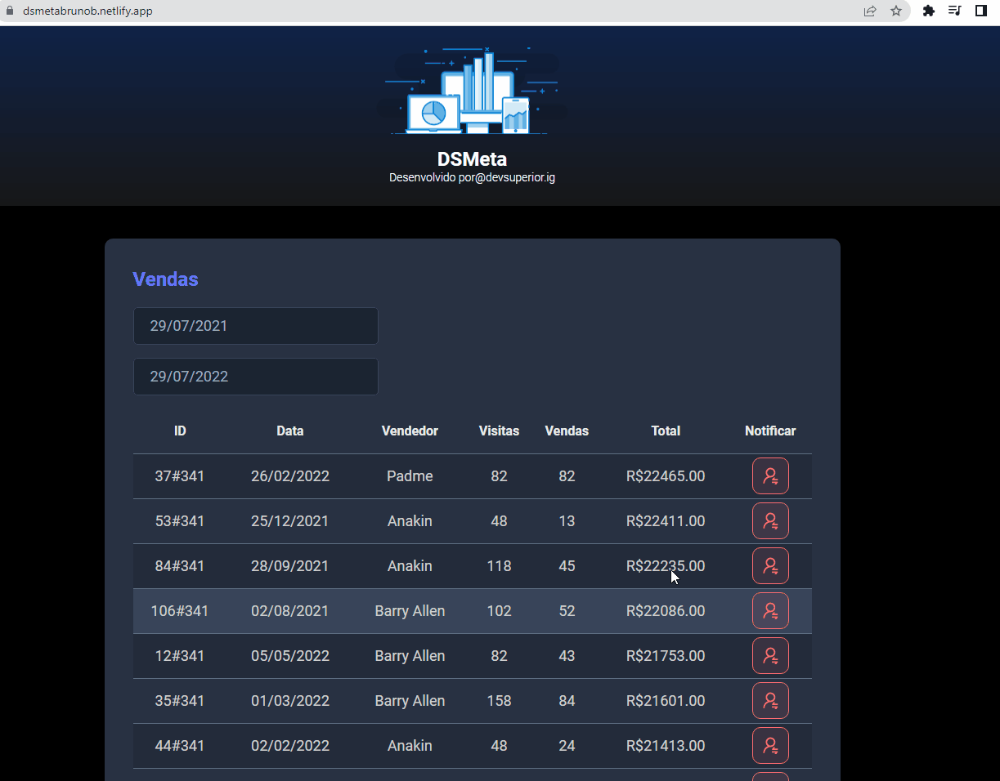

# Estrutura DsMeta HTML-CSS

> Criando estrututa Front-End para projeto em Java chamado DsMeta

#

### Deploy Page

> [DsMeta Github.io](https://brunonavarrooficial.github.io/dsmeta-css/)

### Skills

> HTML

* Tag Semântica

> CSS

* Flex-Box
* Media Query

> Bibliotécas Externas

* [Google Fonts](https://fonts.google.com/about)

<h3>Estrutura do Figma</h3>

#

<h3>Projeto Java Completo</h3>
<a src="https://github.com/Brunonavarrooficial/dsmeta"><h5>Repositório do Projeto 🔗</h5></a>

#

<h3>Mensagem SMS do Twilio</h3>

